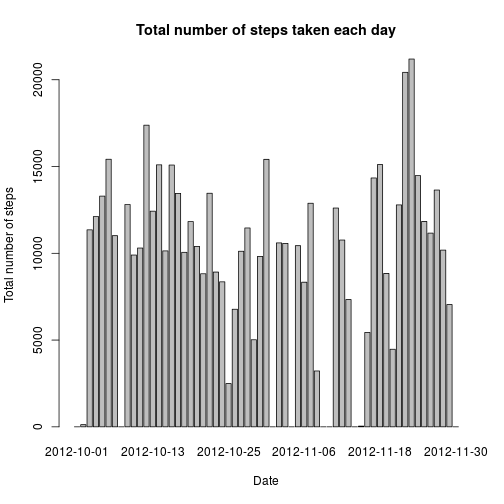
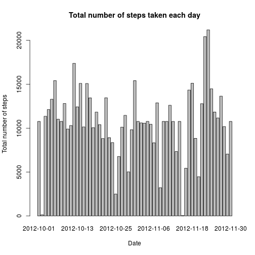
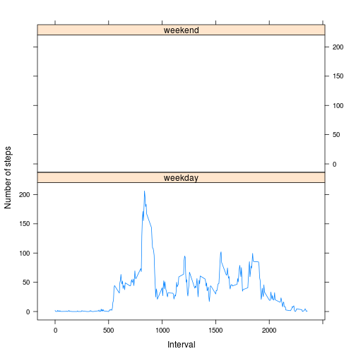

# Reproducible Research: Peer Assessment 1


## Loading and preprocessing the data
Loading and preprocessing data:

```r
data<-read.csv('activity.csv')
data$date<-as.Date(data$date, format="%Y-%m-%d")
```


## What is mean total number of steps taken per day?
Creating the histogram of the average total number of steps taken each day:

```r
datasum<-tapply(data$steps, data$date,sum,na.rm=TRUE)
barplot(datasum,xlab="Date",ylab="Total number of steps",main="Total number of steps taken each day")
```

 

The mean of the average total number of steps taken per day is 9354.2295, while the median is 10395.

## What is the average daily activity pattern?
Creating a plot of the average steps taken in each 5-minute interval.

```r
datasteps<-tapply(data$steps,data$interval,mean,na.rm=TRUE)
bla<-cbind(interval=unique(data$interval),steps=datasteps)
bla2<-strptime(unique(sapply(data$interval, formatC, width = 4, flag = 0)),format="%H%M")
plot(bla2,bla[,2],type="l",xlab="Hour of the day",ylab="Average steps",main="Daily activity")
```

 

The interval containing the maximum number of steps is the one starting at 08:35:00


## Inputing missing values
Inserting the mean number of steps for the interval, when the data is missing. There are 2304 rows with missing data.

```r
data2<-data
for (i in 1:nrow(data2)){
  if(is.na(data2$steps[i])){
    x<-bla[bla[,1]==data2$interval[i]]
    data2$steps[i]<-x[2]
  }
}
head(data2)
```

```
##     steps       date interval
## 1 1.71698 2012-10-01        0
## 2 0.33962 2012-10-01        5
## 3 0.13208 2012-10-01       10
## 4 0.15094 2012-10-01       15
## 5 0.07547 2012-10-01       20
## 6 2.09434 2012-10-01       25
```

Creating a histogram with the filled-out dataset.

```r
datasum2<-tapply(data2$steps, data2$date,sum,na.rm=TRUE)
barplot(datasum2,xlab="Date",ylab="Total number of steps",main="Total number of steps taken each day")
```

 

This histogram is not different than the previous version.

The mean of the average total number of steps taken per day is 1.0766 &times; 10<sup>4</sup>, while the median is 1.0766 &times; 10<sup>4</sup>. These are also the same as those of the original dataset.


## Are there differences in activity patterns between weekdays and weekends?

Creating a new factor variable with two levels.


```r
days<-c()
for (i in 1:nrow(data2)){
if (weekdays(as.Date(data2$date[i]))=="Saturday" || weekdays(as.Date(data2$date[i]))=="Sunday"){
  days[i]<-"weekend"
}
else{days[i]<-"weekday"}

}
data2$day<-factor(days)
```


Time series plot for weekdays and weekends.

```r
library(data.table)
data2<-data.table(data2)
data3<-data2[,mean(steps),by="interval,day"]
library(lattice)
xyplot(data3$V1~data3$interval| data3$day,type="l",layout=c(1,2),xlab="Interval",ylab="Number of steps")
```

 
